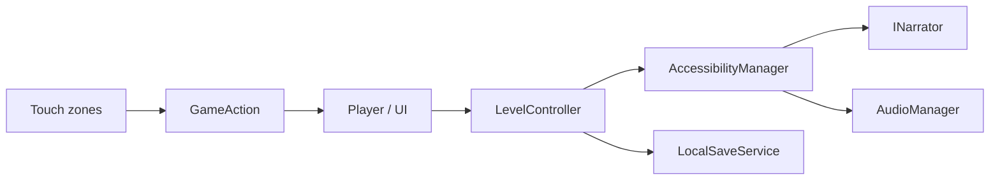

# Architecture

## Overview

EchoQuest uses a small modular architecture suitable for a Bachelor project. Systems communicate through clear ownership and semantic events rather than a heavy framework.

```text
EchoQuest
├── Core            Game state, bootstrap, scene flow
├── Gameplay        Levels, interactables, puzzles
├── Player          Movement and interaction detection
├── Audio           Buses + spatial cues
├── Accessibility   Settings + narration routing
├── Input           GameAction abstraction + touch surface
├── UI              Menus, settings, pause
├── Save            Local persistence only
└── Platform        Android-oriented configuration
```

## Component responsibilities

| Component | Responsibility |
|-----------|----------------|
| `Bootstrap` | Session start (frame rate, sleep lock); later: service wiring |
| `GameManager` | High-level state: Boot / Menu / Playing / Paused / LevelComplete |
| `AccessibilityManager` | Settings + announce routing via `INarrator` |
| `INarrator` / `LogNarrator` | Speak/Stop abstraction; log fallback until Android TTS |
| `AudioManager` | Master / Music / SFX / Voice / A11y volumes |
| `SpatialAudioController` | Distance volume + stereo pan for objects |
| `GameAction` | Device-agnostic input vocabulary |
| `LocalSaveService` | Progress + settings JSON in `PlayerPrefs` |

## Data flow



## Accessibility architecture

Gameplay emits **semantic events** (object nearby, selected, puzzle step correct/incorrect, menu focused).  
`AccessibilityManager` decides narration, cue sounds, and visual emphasis.

**Do not** scatter `if (blindMode)` through gameplay.

## Audio architecture

Separate buses:

- Music
- SFX
- Voice (narration)
- Accessibility cues

Spatial feedback uses **custom stereo pan + distance attenuation** for predictable headphone behavior on Android (instead of relying only on 3D spatializers).

## Input architecture

Unity **Input System** maps hardware / touch to `GameAction`. Portrait layout:

```text
┌─────────────────────┐
│     Game area       │
├─────────────────────┤
│ Move zone │ Actions │
└─────────────────────┘
```

## Save architecture

- Local only (`PlayerPrefs` JSON wrapper)
- Stores: level progress, accessibility preferences
- No accounts, cloud, or analytics

## Mobile architecture

| Setting | Scaffold value | Notes |
|---------|----------------|-------|
| Orientation | Portrait (`defaultScreenOrientation: 1`) | Confirmed for MVP |
| Package | `com.echoquest.game` | Change only if required by store/policy |
| Min API | 24 | **TODO: Verify** after first Android build |
| Target API | Auto (`0`) | Unity uses installed SDK; **TODO: Verify** |
| Architecture | ARM64 | Typical Android phone target |
| Scripting | IL2CPP (Android) | Set in Player Settings |
| Input | Input System only | `activeInputHandler: 1` |
| Unity Analytics / Ads | Disabled | Privacy by design |

## Privacy

- No analytics SDKs
- No advertising SDKs
- No internet requirement for core play
- Unity Connect / Crash Reporting disabled in project settings scaffold

## Performance assumptions

- Simple 2D sprites / primitives
- Few simultaneous looping audio sources (order of tens, not hundreds)
- Target ~60 FPS on mid-range Android phones
- Avoid heavy post-processing and large textures

## Status

Phase 2 wires audio buses, spatial beacons, narration queue, and interactables in a sandbox scene. Menus and scripted levels come next.
